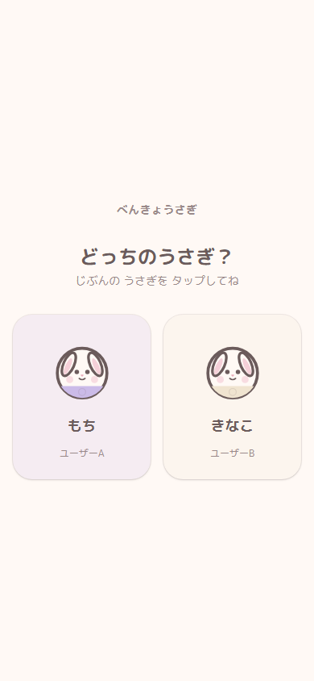
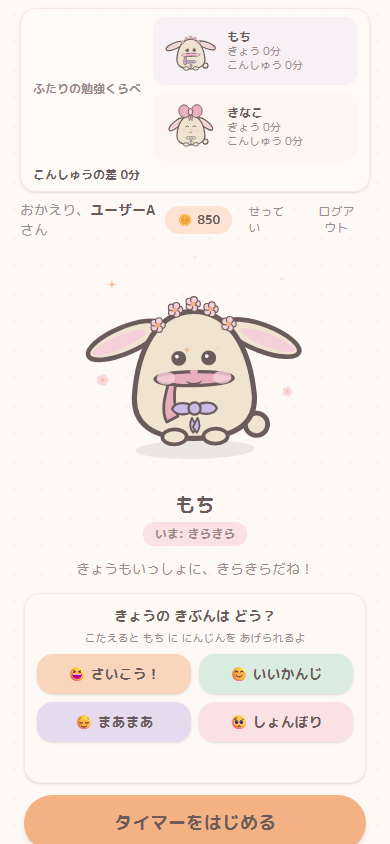
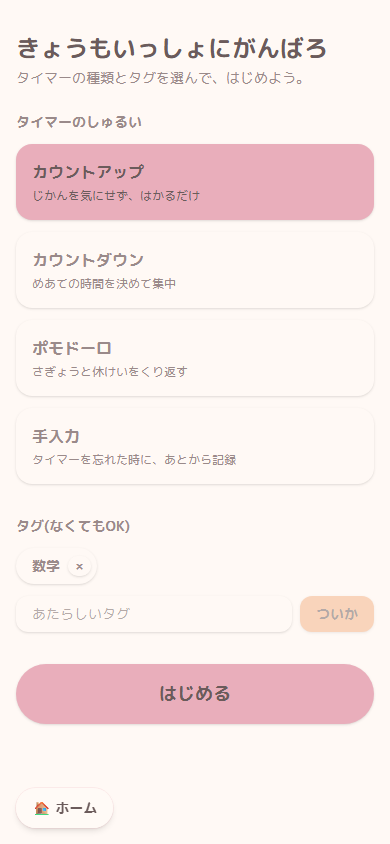
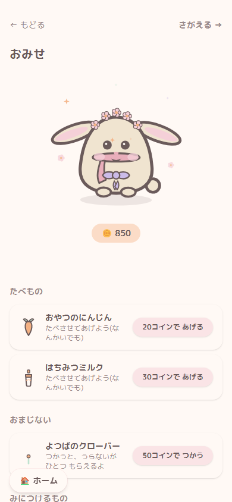
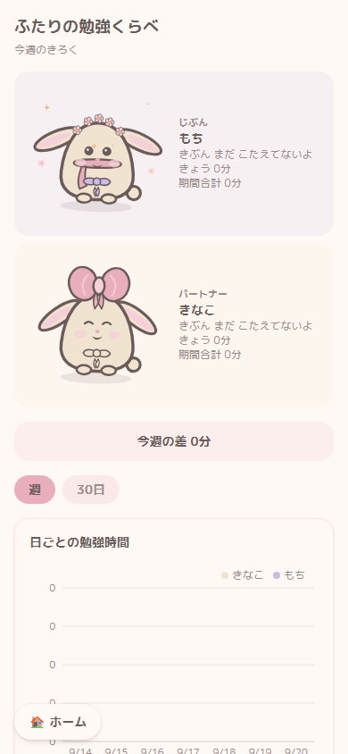

# べんきょうさぎ (benkyousagi)

ふたりで使う勉強タイマーアプリです。集中して勉強した時間に応じて、手描き風のうさぎが元気になります。

このアプリは、最初から利用者を2人に限定した個人用のプレゼントとして制作しました。固定アカウント・PINログイン方式で、新規登録機能はありません。一般向けのSaaSではなく、このリポジトリはポートフォリオとして公開しています。コードと約1,300行の要件定義書は公開していますが、実際に利用している本番環境は意図的に非公開としており、ここからはリンクしていません。

|                             |                             |                            |
| --------------------------- | --------------------------- | --------------------------- |
|  |  |  |
|    |  | |

※スクリーンショットでは、実際のアカウント名やデータではなくダミーを使用しています。

## 主な機能

- **3種類のタイマーモード** — カウントアップ、カウントダウン、ポモドーロに対応。ポモドーロの休憩はスキップ可能です。計測し忘れた場合に備えて、手動入力による記録も用意しています。
- **勉強量に反応するうさぎ** — 勉強すると元気度が上がり、しばらく勉強しないと少しずつ下がります。元気度に応じて6段階の表情に変化します。継続日数を失敗扱いするような厳しい仕組みではなく、「しばらく会えないと少し寂しそうにする相棒」という位置づけです。
- **不正な勉強時間を記録しにくい仕組み** — タイマーの状態遷移に、サーバー発行時刻、無操作時の自動停止、クラッシュ・タブ終了後の復旧処理を組み込んでいます。タブを閉じたまま勉強時間だけを増やすことはできません。
- **ふたりの勉強状況を共有できる画面** — 常に確認しやすい比較ウィジェットに加え、日別・週別・タグ別でふたりの勉強時間を確認できる詳細画面があります。
- **勉強で貯まるコインとショップ** — 勉強でコインを獲得し、アクセサリー、服、部屋の家具、ちょっとした消耗品などに使えます。コインを不正に稼ぐために短いセッションを連打しても有利にならないよう、うさぎの元気度とは別の仕組みにしています。
- **モバイルファーストの手描き風UI** — すべての画面を、やわらかい雰囲気の手描きSVGを中心に設計しています。アイコンフォントや既製のイラストライブラリには依存せず、PC表示にも対応しています。

## 技術構成

- **Next.js 16**（App Router、Turbopack、Server Actions）+ **React 19**
- **Prisma 7** の新しいドライバーアダプタ方式を採用。開発環境ではローカルのSQLite、本番環境では [Turso](https://turso.tech)（libSQL）を利用し、同じスキーマで動作します。どちらも無料枠で運用できます。
- **Tailwind CSS 4** + **Framer Motion** — うさぎの待機アニメーションやリアクションに使用
- **Recharts** — 勉強時間の集計グラフに使用
- 認証は外部の認証サービスを使わず、PIN + 署名付きCookieによる独自実装です。固定2アカウントだけで使うため、外部IDプロバイダは採用していません。

## 見てほしいポイント

- [`docs/REQUIREMENTS.md`](docs/REQUIREMENTS.md) — 実装前に作成・更新した要件定義書です。機能仕様、明示的な対象外項目、データモデル、意思決定ログまで含んでいます。開発は「要件・クリエイティブ設計」と「実装」を分けて進めたため、後から付け足した説明ではなく、実際の引き継ぎ資料に近い内容になっています。
- [`src/app/timer/run/[sessionId]/_lib/engine.ts`](src/app/timer/run/[sessionId]/_lib/engine.ts) — タイマーを複数の `useState` に分散させず、純粋でテストしやすい状態機械として実装しています。一時停止・再開・無操作停止・復旧といった境界ケースを扱いやすくしています。
- [`src/lib/rabbit-status.ts`](src/lib/rabbit-status.ts) — 元気度の減衰計算は、「最後の勉強セッション終了時刻」を基準に読み取り時に再計算する純粋関数です。アプリを長時間閉じていても、常駐処理なしで正しい状態を復元できます。
- [`src/app/apple-icon.tsx`](src/app/apple-icon.tsx) — iOSのホーム画面用アイコンは、アプリ内で使っている手描きのうさぎSVG部品を再利用し、`next/og` の `ImageResponse` でビルド時に生成しています。別途書き出した静的画像は使っていません。
- [`DEPLOY.md`](DEPLOY.md) — Vercel + Turso の無料枠でデプロイする手順です。`prisma migrate deploy` が Turso の `libsql://` 接続方式を認識しない問題への回避策もまとめています。

## ローカルで動かす

このアプリは、不特定多数が登録して利用する構成にはしていません。新規登録機能はなく、ショップの商品一覧もコード内に固定で定義しています（理由は `src/lib/shop.ts` のコメントを参照してください）。ただし、ローカル開発の流れ自体は通常の Next.js + Prisma 構成です。

```bash
npm install
npm run db:migrate      # ローカルの prisma/dev.db にマイグレーションを適用
npm run db:seed         # 固定2アカウントを作成（環境変数で名前とPINを変更可能）
npm run dev
```

Turso + Vercel の無料枠へデプロイする場合は、[`DEPLOY.md`](DEPLOY.md) を参照してください。
